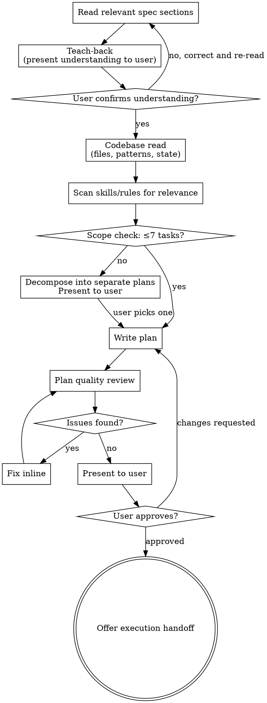

# Planning

Write small, focused implementation plans that an executing agent can reliably complete without losing context. Plans describe *what* and *why* — the executor writes the code after reading the actual files.

**Announce at start:** "I'm using the planning skill to create the implementation plan."

## Philosophy

- **Plans are disposable.** The spec is the source of truth. Plans are lightweight execution guides for one deliverable.
- **No code in plans.** Describe everything in prose — including verification steps ("Run the type checker and test suite to verify"). The executor reads the current file and writes the code. It knows the exact commands from the codebase.
- **Small plans, iterative delivery.** Each plan = one testable deliverable. Implement it, verify it, then plan the next deliverable in a new session with real code to reference.
- **Deliverable-first, dependencies-backward.** Start with the end result — the page, the API, the component the user will see. Then work backward into what's needed to build it. This keeps every task tethered to the deliverable. Never front-load infrastructure divorced from the thing it serves.
- **Build up from small working pieces.** Create the deliverable first (even if it can't fully work yet), then build each dependency with tests first, then wire it into the parent. Each piece is small, tested, and composed into the whole — not "build all deps, then assemble."
- **Codebase-first.** Read the files before planning changes to them. Plans that assume file state are plans that drift.
- **TDD by default.** Tasks that produce testable logic direct the executor to write tests first.

## Process

## Teach-Back

After reading the spec, **stop and demonstrate understanding before proceeding.** Reading is not understanding — the teach-back forces synthesis and catches misinterpretation at the cheapest possible moment.

Present to the user in your own words:

1. **What we're building** — the deliverable in one sentence, not the spec's words
2. **Key constraints** — what shapes the approach (tech choices, patterns to follow, things explicitly excluded)
3. **Relationships** — how this connects to what already exists and what comes after
4. **The hard parts** — what's non-obvious, where ambiguity exists, what could go wrong

Do NOT parrot the spec back. Synthesize. If you can't explain it without looking at the spec, you don't understand it well enough to plan it.

Wait for the user to confirm or correct before proceeding. If corrected, re-read the relevant spec section with the correction in mind.

## Codebase Read

**First step after teach-back is confirmed.** You can't scope, decompose, or plan without knowing the current state. Read:

1. **Files that will be modified** — understand current state, not assume it
2. **Adjacent files** — imports, callers, tests that might be affected
3. **Established patterns** — how does the codebase already do this kind of thing? Follow it.

Reference what you read in the plan. "The existing data layer pattern in `src/data/properties/` uses `shared.ts` + `server.ts` + `client.ts` — follow this for the new domain."

## Scope Gate

With the codebase state understood, assess: can this work be done in **5-7 tasks**?

**If yes** — proceed to write the plan.

**If no** — **stop.** Do not write a large plan. Instead, decompose the work into **separate plans**, each with its own deliverable that can be completed and verified independently. Present the breakdown to the user and ask which plan to write first. **Write only that one plan** (5-7 tasks), then hand off for implementation.

The next plan gets written in a future session, after the previous plan is implemented and verified. That session reads the real, updated codebase — not assumptions from a plan written earlier.

**Never write more than one plan at a time.** The planner proposes the breakdown, writes one plan, and stops.

### What counts as a deliverable

A deliverable is a working route, page, or endpoint that an engineer can load and verify in a browser or test suite. "All migrations applied" is not a deliverable. "The provider registry page loads and displays providers" is a deliverable.

### Decompose by vertical slice, not horizontal layer

Each plan must be a vertical slice — a working feature that includes its own route, data layer, and only the infrastructure it needs. The deliverable-first principle applies to decomposition, not just task ordering within a plan.

**Never decompose by technical layer.** Don't create plans like "Plan 1: all migrations, Plan 2: all shared components, Plan 3: all pages." This front-loads infrastructure divorced from what it serves. Instead, each plan delivers a working page/feature and pulls in only the migrations, components, and utilities that specific page needs.

| Wrong (horizontal layers) | Right (vertical slices) |
|---|---|
| Plan 1: All database migrations | Plan 1: Provider registry page (+ its migrations, client, auth) |
| Plan 2: All shared components | Plan 2: Provider detail page (+ its components, data layer) |
| Plan 3: All page routes | Plan 3: Accuracy dashboard (+ threshold components, trend charts) |

> "This spec is too large for a single plan. Based on the codebase, I'd break it into these vertical slices, each its own plan → implement → verify cycle:
> 1. [Plan name] — Deliverable: [a working page/feature an engineer can load and verify]
> 2. [Plan name] — Deliverable: ...
> 3. [Plan name] — Deliverable: ...
> Which plan should I write first?"

## Skill & Rule Scan

Discover available skills and rules at runtime — don't rely on a hardcoded list. Scan:

1. **Project skills** — `.claude/skills/*/SKILL.md` (e.g., `frontend-patterns`, `design-system`, `testing`)
2. **Project rules** — `.claude/rules/*.md` (e.g., `database-migrations`, `security-lgpd`)
3. **Global rules** — `~/.claude/rules/*.md` (user-level rules that apply across projects)
4. **Plugin skills** — listed in the system-reminder skill list (e.g., `frontend-design:frontend-design`, `superpowers:test-driven-development`)

For each task in the plan, include a one-line `**Check:**` pointer to skills/rules the executor should load. Use the skill's full name as it appears in the skill list (e.g., `frontend-design:frontend-design` for plugin skills, `frontend-patterns` for project skills).

Example: "**Check:** `frontend-patterns` (data fetching, hook ordering), `database-migrations` (additive, non-destructive), `frontend-design:frontend-design` (if building new UI)"

Only include pointers that are genuinely relevant to the task. Don't list every skill.

## Plan Format

**Save to:** `docs/superpowers/plans/YYYY-MM-DD-<feature-name>.md`

The plan document has these sections in order: Header, Codebase Context, File Structure, Tasks, Final Task.

**Header** — goal, deliverable, spec reference, dependencies:

    # [Feature Name] — Implementation Plan
    > For agentic workers: Use superpowers:subagent-driven-development or superpowers:executing-plans
    Goal: ... | Deliverable: ... | Spec: ... | Depends on: ... | Blocks: ...

**Codebase Context** — patterns to follow (with file path examples), current state facts. This bridges the codebase read to the tasks — the executor may not have done the same exploration.

**File Structure** — one line per file to create or modify, what it's responsible for. This is the decomposition — lock it in before writing tasks.

**No code in the plan.** Everything is described in prose. The executor reads the actual files and writes the implementation. Verification steps describe what to run, not the exact commands (e.g., "Run the type checker, test suite, and linter to verify") — the executor knows the commands from the codebase.

**Tasks** — ordered deliverable-first, built up from small working pieces:

1. Start with the deliverable — the route, page, or component the user will see. It won't fully work yet, but it establishes what we're building.
2. Work backward into each dependency it needs. For each dependency: write tests first (TDD), build the implementation to pass the tests, then wire it into the parent that needs it.
3. Each task produces a small, tested, working piece that composes into the whole.

Each task states: what to change, why, where, how to verify, what to commit. Describe changes in prose — no code blocks. Include `**Check:**` pointers to relevant skills/rules.

If a task needs something that doesn't exist yet (a hook, a utility, a table), create it in the same task or the task immediately before — not in a front-loaded "infrastructure" block divorced from what uses it. Dependencies are pulled in by the deliverable, not pushed ahead of it.

**TDD by default.** For tasks that produce testable logic (functions, utilities, data transformations, server actions), direct the executor to write tests first — state what the test should assert, then describe the implementation. The executor uses `superpowers:test-driven-development`. Pure scaffolding tasks (route files, dependency installs, migrations) don't need TDD.

**Final Task: Verification & Code Review** — every plan ends with: (1) type check + test suite + lint, (2) dispatch `superpowers:code-reviewer` against the spec sections this plan implements, (3) address findings and re-verify.

## Plan Quality Review

After writing the plan, review it yourself before presenting to the user. This catches plan-level problems before they become implementation problems.

**Check for:**

1. **Spec drift** — Re-read the spec sections this plan covers. Is every requirement accounted for in a task? List any gaps and add tasks.

2. **Inconsistencies between tasks** — Do function names, types, file paths, and imports match across tasks? Does task 5 reference the same name defined in task 3?

3. **Ambiguous descriptions** — Could any task description be implemented two different ways? If so, make the intent explicit. Ambiguity in a plan becomes bugs in implementation.

4. **Regression risk** — Do any changes break existing callers, tests, or behavior? If a type signature changes, note which files need updating. If a table is renamed, note which code references the old name.

5. **Missing context** — Does any task require knowledge the executor won't have from reading the referenced files? Add it.

6. **Plan size** — More than 7 tasks? **Stop writing. Loop back to the Scope Gate.** Present the decomposition to the user as separate plans with deliverables, ask which one to write first, and start over with only that scope.

7. **Code block check** — Any code blocks in the plan? Rewrite as prose. The executor writes the code.

8. **Assumption check** — Does this plan assume files exist that haven't been created yet (by a prior unimplemented plan)? If so, note the dependency explicitly.

9. **Vertical slice check** — Is this plan a vertical slice with a visible deliverable? Or is it a horizontal layer (all migrations, all components, all utilities) divorced from a working feature? If horizontal, loop back to the Scope Gate and re-decompose as vertical slices.

For checks 1-5 and 7-8, fix issues inline — no need to re-review. For #6 (plan too large) and #9 (horizontal layer), do not fix inline — loop back to the Scope Gate and decompose.

## What This Skill Does NOT Do

- **Execute plans** — handoff to `superpowers:subagent-driven-development` or `superpowers:executing-plans`
- **Write specs** — that's `superpowers:brainstorming`
- **Contain implementation code** — the executor writes code, not the plan
- **Load domain skills** — it points the executor to them

## Execution Handoff

After the user approves the plan:

> "Plan saved to `docs/superpowers/plans/<filename>.md`. Two execution options:
>
> **1. Subagent-Driven (recommended)** — fresh agent per task, review between tasks
> **2. Inline Execution** — execute tasks in this session with checkpoints
>
> Which approach?"
