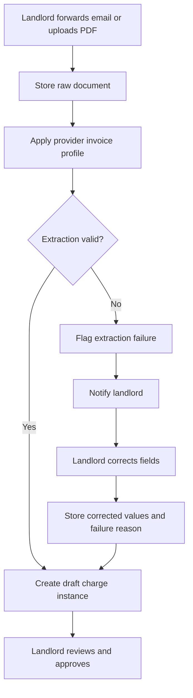
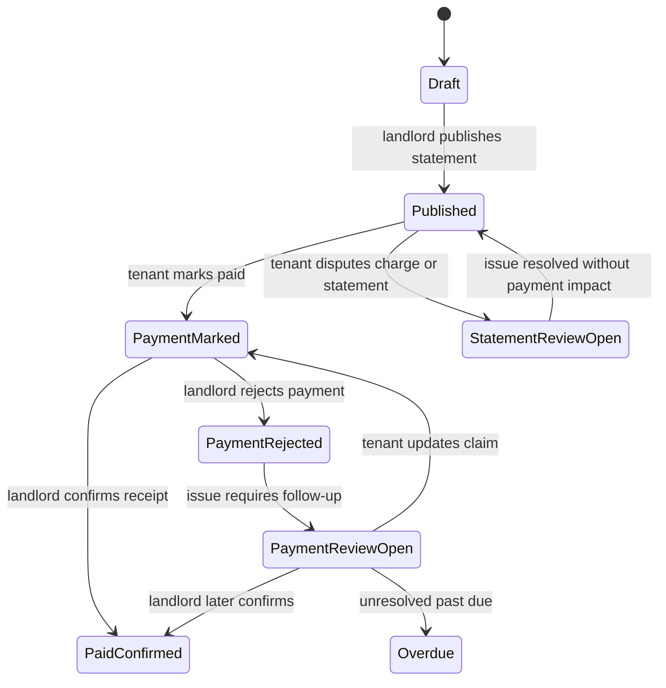
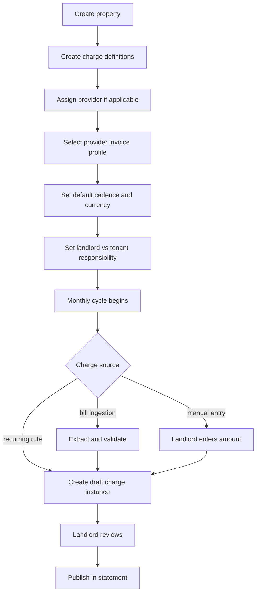

# mabenn — Rental Billing & Utility Coordination MVP

_A shared billing and charge-coordination app for landlords and tenants in Brazil_

**Client Goal:** Build a simple, trustworthy app that helps landlords manage rent and recurring property charges across multiple properties while giving tenants clear visibility into what they owe and why. The initial product should reduce manual spreadsheet work, improve transparency, support shared responsibility and multi-tenant coordination, and create a strong foundation for future payment automation, portfolio analytics, and monetization.

## Table of Contents

- [1. The Problem & Vision](#1-the-problem--vision)
- [2. User Personas](#2-user-personas)
- [3. User Experience & App Walkthrough](#3-user-experience--app-walkthrough)
- [4. Competitive Landscape](#4-competitive-landscape)
- [5. Feature Prioritization](#5-feature-prioritization)
- [6. Design Direction](#6-design-direction)
- [7. Technical Approach](#7-technical-approach)
- [8. Cost & Investment Overview](#8-cost--investment-overview)
- [9. Development Roadmap](#9-development-roadmap)
- [10. Risks & Considerations](#10-risks--considerations)
- [11. Recommended Next Steps](#11-recommended-next-steps)

---

## 1. The Problem & Vision

Today, many landlord-tenant billing workflows still run on spreadsheets, email threads, and manual money transfers. A landlord receives bills from multiple providers, updates a spreadsheet by hand, and the tenant later reviews that spreadsheet, calculates what is owed, and sends payment through a separate tool. Even when both parties are cooperative, the workflow is fragile. It depends on manual entry, shared assumptions, and constant follow-up.

The problem becomes bigger when charges are not limited to rent. Condo fees, electric, gas, water, internet, and other recurring or variable charges all need to be tracked, categorized, allocated, and communicated clearly. In some households, multiple tenants need to split the tenant portion of charges among themselves. In others, the landlord partially covers specific charges. The spreadsheet model breaks down quickly because it does not provide enough structure, validation, or transparency.

This manual intervention can also put strain on the landlord-tenant relationship. It creates room for mistakes, misunderstandings, and distrust. Additional charges can be entered incorrectly by accident, or perceived as inflated or unfair by the tenant. When the tenant has limited visibility into how those values were derived, the relationship can become more transactional and defensive than it needs to be.

This product solves that by replacing ad hoc coordination with a shared billing workspace built specifically for rent and property charges. It also gives landlords a centralized place to manage multiple properties, compare monthly revenue and costs, and build a more organized operational view of their rental business over time. The first version is not a payment app. It is a trust-first billing system that helps landlords define charges, ingest bills, validate extracted bill data, publish clear monthly statements, and let tenants see exactly what they owe and why. More importantly, it creates a bridge to a better landlord-tenant relationship through trust, transparency, and accountability. Over time, the product can expand into bill automation, payment orchestration, portfolio analytics, and platform-based monetization. If the core billing workflow proves valuable, the product may eventually expand into a broader landlord-tenant communication hub where important property-related conversations happen alongside billing records and financial history.

### Business Model

The business model should be phased, matching the product’s maturity and trust level.

**Initial monetization options:**
- Pilot partnership model with one or more landlords
- Flat monthly SaaS fee per landlord or per active property/unit
- Premium add-ons for bill automation and operational convenience

**Later monetization options:**
- AI-assisted validation as a premium add-on
- Utility automation package
- Payment convenience fees for PIX and credit/debit card usage
- Platform fee on in-app payment volume once payment rails are introduced
- Multi-property analytics and reporting package for landlords

**Builder cost note:**
- Claude Code subscription: **$100 USD / month**. This is currently founder-covered and should be treated as an internal operating cost during the MVP phase, not necessarily a cost passed to Alex initially.

The important strategic choice is to avoid depending on payment revenue before in-app payments exist. The MVP should prove that landlords and tenants trust the shared billing workflow first.

### Core Product Principles

- **Trust first:** every charge should have a clear source, validation path, and audit trail
- **Transparency by default:** landlords and tenants should see the same monthly statement logic
- **Low friction:** the app should feel simpler than the spreadsheet it replaces
- **Growth through collaboration:** each landlord invites tenants, tenants can invite other tenants in the household, and the workflow naturally drives adoption
- **Brazil-first focus:** the MVP should optimize for Brazilian landlord billing workflows, providers, compliance, and user expectations
- **Build for expansion:** support future automation, multiple countries, multiple currencies, multiple billing cadences, payment rails, and multi-property analytics without needing a rewrite

### Growth Strategy

This product has built-in viral potential because billing is naturally collaborative. A landlord invites tenants to view monthly statements. A tenant can invite other tenants in the household so everyone sees the same source of truth. Shared monthly statements and transparent charge history create natural opportunities for word-of-mouth adoption.

Key growth levers:
- Landlord-to-tenant invites for statement visibility
- Tenant-to-tenant household invites for split coordination and shared visibility
- Tenant-invites-landlord flow for new landlord acquisition
- Public landing page and self-serve landlord sign-up
- Shared monthly statements as the system of record
- PWA install prompts for active users
- A clean, trustworthy UX that reduces money-related friction and encourages sharing

The first version should grow primarily through organic adoption within existing landlord-tenant and household networks, plus public landing-page conversion and word-of-mouth, rather than paid advertising.

### How We Measure Success

The product should be instrumented from day one with analytics tied directly to the product principles: trust, transparency, low friction, collaboration, and scalable growth. The goal is not just to measure activity, but to understand whether the product is becoming the trusted monthly system of record for rent and related charges.

These metrics should be defined at the business level in the product plan first, then translated into event-level analytics instrumentation during implementation. The definitions below are intentionally practical so the team can align on what each metric means before building dashboards.

#### Activation & Adoption

| Metric                                | Definition                                                                                                                                                             | What it tells us                                                                        | Why it matters                                                                                                          |
| ------------------------------------- | ---------------------------------------------------------------------------------------------------------------------------------------------------------------------- | --------------------------------------------------------------------------------------- | ----------------------------------------------------------------------------------------------------------------------- |
| **Landlord activation rate**          | Percentage of new landlord accounts that create at least one property, add at least one charge definition, and publish at least one statement within 30 days of signup | Whether landlords can get from signup to a usable first property and statement workflow | Tests onboarding friction and validates the assumption that setup is simpler than the current spreadsheet-based process |
| **Time to first published statement** | Median time between landlord signup and first statement publish                                                                                                        | How long it takes a landlord to reach the first real moment of value                    | Measures intuitiveness, operational efficiency, and how quickly the product becomes useful                              |
| **Tenant statement view rate**        | Percentage of published statements that are opened by at least one tenant within 7 days of publish                                                                     | Whether tenants actually open and review the statements they receive                    | Measures transparency, notification effectiveness, and whether the statement is becoming the shared system of record    |

#### Operational Value

|Metric|Definition|What it tells us|Why it matters|
|---|---|---|---|
|**Monthly statement publish rate**|Percentage of active landlord accounts that publish at least one statement in a given month|Whether landlords are using the product each month as their operational billing workflow|Strong signal of retained value and whether the app is truly replacing the spreadsheet|
|**Statement view-to-payment mark rate**|Percentage of tenant-viewed statements that are later marked paid by a tenant before the due date|Whether tenants move from reviewing the statement to taking action|Measures whether statements are clear enough to drive completion and whether reminders/workflows are effective|
|**Statement payment resolution time**|Median time between a tenant marking a statement paid and the statement reaching a final confirmed or rejected state|How quickly marked-paid statements are confirmed or resolved|Shows whether the manual payment workflow is smooth or causing confusion|
|**Statement completeness warning rate**|Percentage of draft statements that trigger at least one missing-expected-charge warning before publish|How often expected charges are missing at draft time|Measures whether the system is helping landlords catch omissions before publish|
|**Landlord monthly time saved**|Average self-reported landlord response to a lightweight monthly prompt about whether billing took less time than their previous process|Whether landlords feel the app reduces monthly admin work|Validates one of the core product promises; this may begin as a survey metric rather than a behavioral one|

#### Growth & Expansion

| Metric                                      | Definition                                                                                                          | What it tells us                                                                 | Why it matters                                                 |
| ------------------------------------------- | ------------------------------------------------------------------------------------------------------------------- | -------------------------------------------------------------------------------- | -------------------------------------------------------------- |
| **Tenant Invite conversion rate**           | Percentage of tenant invites that result in a completed joined account within 14 days                               | Whether invited tenants actually join                                            | Measures how well the collaborative workflow drives adoption   |
| **Tenant household invite adoption rate**   | Percentage of tenant-viewed properties where at least one tenant invites another household member                   | Whether tenants invite other tenants in the household                            | Helps validate the household coordination loop                 |
| **Tenant-invites-landlord conversion rate** | Percentage of tenant-sent landlord invites that result in a landlord account signup within 30 days                  | Whether tenant-originated landlord invites convert into active landlord accounts | Measures one of the most important new-landlord growth loops   |
| **Landlord acquisition source mix**         | Distribution of new landlord signups by attributed source: public landing page, tenant invite, or landlord referral | Whether landlords come from the landing page, tenants, or referral paths         | Helps identify which acquisition loop is actually working      |
| **Properties managed per landlord**         | Average number of active properties per landlord account                                                            | Whether landlords expand usage from one property to multiple properties          | Strong signal of account expansion, trust, and product breadth |

#### Trust & Quality

|Metric|Definition|What it tells us|Why it matters|
|---|---|---|---|
|**Extraction success rate**|Percentage of imported bills that produce a usable draft charge without landlord correction|How often bill ingestion works without correction|Measures automation quality and whether the product is saving time without sacrificing trust|
|**Correction rate by provider invoice profile**|Percentage of imported charges using a given invoice profile that require at least one landlord correction before publish|Which invoice formats create the most friction and why|Helps prioritize invoice-profile improvements and trust-building work|
|**Statement dispute / rejection rate**|Percentage of published statements that result in either a tenant dispute or a payment rejection event|How often billing or payment workflows break down enough to require review|Important trust metric; high rates suggest confusion, unclear rules, or weak workflows|
|**Charge dispute rate**|Percentage of published statements containing at least one charge dispute|How often tenants flag individual charges or allocations for review|Measures whether the app is surfacing issues that used to stay hidden and whether billing assumptions are aligned|
|**Tenant trust / clarity score**|Average response to lightweight tenant prompts such as “Was this statement clear?” and “Do you trust the listed charges?”|Whether tenants feel the statement and charges are understandable and credible|Core trust metric tied directly to the product’s transparency promise|
|**Landlord confidence score**|Average response to lightweight landlord prompts such as “How confident are you that this statement was accurate?”|Whether landlords feel the system is helping them manage billing accurately and efficiently|Helps confirm that trust is being built on both sides of the relationship|

#### Lightweight Product Pulse Surveys

Some of the most important product questions are better answered through short in-app prompts than behavioral analytics alone. The MVP should include occasional one-question surveys such as:
- **Tenant:** “Do you trust the charges on this statement?”
- **Landlord:** “Did this month’s billing take less time than your previous process?”

##### Tenant trust pulse — placement and display rules

- **When:** Shown on the tenant’s payment-confirmed screen — the end of a completed billing cycle, when the tenant has reviewed, paid, and received confirmation
- **First cycle:** Always shown
- **After that:** Shown occasionally (e.g. every 3rd cycle, or ~30% random)
- **Open disputes:** Never shown if the tenant has an open/unresolved dispute on this statement
- **Resolved disputes:** DO show if there was a dispute that has since been resolved — this captures whether the dispute resolution process itself built or eroded trust
- **Rationale:** Asking at payment confirmation is the natural moment of reflection. Asking on the statement view (before action) creates friction. Asking after a dispute submission is a false positive — of course they don’t trust it, that’s why they disputed.

##### Landlord confidence pulse — placement and display rules

- **When:** Shown after the landlord publishes a statement (post-publish success screen)
- **First statement:** Always shown
- **After that:** Shown occasionally
- **Rationale:** Publishing is the landlord’s moment of commitment — the right time to gauge confidence

These should be used sparingly and tied to key workflow moments so they feel useful rather than intrusive.

These metrics should be reviewed together rather than in isolation. The product is successful only if it becomes easier than the current spreadsheet workflow while increasing transparency, trust, and collaborative adoption.

---

## 2. User Personas

### Persona 1: Alex — The Hands-On Landlord

**Age:** 40s · **Tech comfort:** Moderate · **Device:** Laptop + iPhone

Alex manages multiple rental units and currently uses a spreadsheet to track monthly charges across his properties. He receives rent, condo fees, and utility bills through a mix of emails, PDFs, and provider portals. He wants a simpler way to keep everything organized and shared with his tenants without increasing his admin burden. More importantly, he wants to spend less time each month managing billing, answering questions, and reconciling payments.

**What he needs:**
- A reliable place to manage rent and recurring property charges across multiple properties
- Easy bill ingestion and manual fallback when automation fails
- Transparent charge allocation between landlord and tenant(s)
- Confidence that monthly statements are correct before publishing
- A workflow that reduces the monthly time he spends managing billing and payment coordination

**Frustration with current tools:**
- Manual spreadsheet updates every month
- Repeating the same charge math and explanations
- No clear workflow for validation, sharing, and payment confirmation
- Too much monthly operational overhead for something that should be routine

**Success signal:**  
Alex stops relying on spreadsheets, publishes statements consistently, and experiences less monthly admin work. Tracked by: landlord activation rate, time to first published statement, monthly statement publish rate, landlord monthly time saved, monthly landlord retention, and properties managed per landlord.

### Persona 2: Brandon — A Tenant Who Wants Transparency

**Age:** 40s · **Tech comfort:** High · **Device:** Android + Laptop

Brandon rents an apartment and wants visibility into rent and monthly charges without needing to reconcile a spreadsheet manually. He wants to understand what he owes, when charges were added, how totals were calculated, and whether a charge came directly from a bill or was corrected before publishing. He does not want to chase side conversations to understand what changed.

**What he needs:**
- A clear monthly statement
- Transparency into the source and amount of each additional bill
- Confidence that charges are correct and not arbitrary
- Notifications when the statement is ready, updated, and due
- A simple way to mark payment activity and keep everyone aligned
- A structured way to question or dispute a charge if something looks wrong

**Frustration with current tools:**
- Spreadsheet math and manual calculation outside the app
- No shared system of record
- Limited trust in how utility values are entered or adjusted
- Payment coordination and follow-up happening across multiple channels

**Success signal:**  
Brandon regularly opens statement notifications, reviews the monthly statement, and feels confident paying from a transparent shared record. When something looks wrong, he can raise it clearly instead of relying on side conversations. Tracked by: tenant statement view rate, statement view-to-payment mark rate, charge dispute rate, tenant trust / clarity score, and monthly engagement on published statements.

### Persona 3: Mariana — A Tenant Coordinating a Shared Household

**Age:** 26 · **Tech comfort:** High · **Device:** iPhone

Mariana lives with other tenants and often ends up coordinating who owes what. She does not want to argue about partial shares or manually recreate the landlord’s statement in another app. She wants to divide only the tenant-side portion of charges in a way that is visible and fair, and she wants the other tenants to have the same visibility she does.

**What she needs:**
- A simple way to divide the tenant portion of charges
- Clear visibility into who owes what within the household
- An easy way to invite other tenants into the app
- A lightweight mobile-first interface that does not feel like accounting software

**Frustration with current tools:**
- Venmo/Wise/notes app side calculations
- Lack of transparency and version control
- Repeated reminders
- No shared tenant-level source of truth

**Success signal:**  
Mariana invites other tenants, sets up the split once, and uses the app each month without rebuilding the math elsewhere. Tracked by: tenant household invite adoption rate, split adoption rate, invite conversion rate, and recurring reuse of split setups.

---

## 3. User Experience & App Walkthrough

### Journey 1: First-Time Landlord Setup

Alex signs in with Google or email from a public landing page and creates his first property. He adds the unit address, names the unit, selects the default currency, and defines the monthly rent charge. He then adds expected charges such as electric, water, gas, condo fee, and internet, deciding which are fixed recurring charges and which are variable charges that will come from bills. For each charge, he defines whether the responsibility belongs to the landlord, the tenant group, or a shared split. He then adds one or more tenants to the property so the collaboration loop starts immediately.

At the end of setup, Alex gets a quick one-question prompt such as: **“Was setting up this property easier than your usual process?”** This gives early signal on onboarding friction and whether the product already feels simpler than the spreadsheet workflow.

**Note:** Address verification in Brazil may be useful later, but it does not need to block the MVP. The MVP can start with user-entered addresses plus basic validation rules, then evolve into stronger verification if needed.

**Wireframes:** <a href="../wireframes/journeys/01-landlord-first-setup.html" target="_blank">Journey 1 — First-Time Landlord Setup</a>

### Journey 2: Defining a Variable Charge and Selecting the Correct Invoice Profile

Alex creates a variable charge such as electric or water. He selects the provider and then selects the matching **provider invoice profile** for that charge. Because a single provider may issue multiple invoice formats, the app should show example document previews or example PDFs for each available invoice profile to help him choose the correct one.

**Important:** All example document previews shown to users must have personal information redacted (names, addresses, account numbers, CPF/CNPJ, etc.). Example documents should demonstrate the bill layout and format without exposing real personal data.

If Alex sees the right invoice profile, he selects it and the system uses that profile for future extraction. If he does not see the correct one, he can submit a request for a new invoice profile.

That request should include:
- provider name
- invoice profile name or short label
- sample bill PDF
- optional note explaining how to recognize the invoice or how it is used

For the MVP, the engineering/admin team handles all extraction configuration behind the scenes. There is no end-user UI for defining extraction logic. Once the team creates the invoice profile and extraction rules, Alex receives a notification that the new invoice profile is ready to use.

This workflow is important because it keeps the MVP trustable and operationally manageable while still making the extraction system data-driven from the beginning.

**Wireframes:** <a href="../wireframes/journeys/02-variable-charge-invoice-profile.html" target="_blank">Journey 2 — Variable Charge & Invoice Profile</a>

### Journey 3: Bill Ingestion and Validation

Alex forwards a utility bill email to the app’s ingestion address or uploads the bill manually in the app. The system stores the raw email and attachment, applies the selected provider invoice profile, and creates a draft charge instance with extracted fields. Alex receives a notification prompting him to review the extraction. For the MVP, notifications should support email and in-app delivery, with push notifications treated as optional if implementation remains lightweight.

If Alex sees that a field was extracted incorrectly, he can identify what was wrong, optionally note why, and correct the value before approval. If extraction fails or key fields are missing, Alex is notified immediately and the app asks him to correct the fields before the charge can be used. These corrections become useful product data for improving invoice profiles and reducing future failures.

After completing review, Alex may occasionally see a one-question prompt such as: **”Did this review process feel accurate and trustworthy?”**

**Wireframes:** <a href="../wireframes/journeys/03-bill-ingestion-validation.html" target="_blank">Journey 3 — Bill Ingestion & Validation</a>

### Journey 4: Monthly Statement Drafting and Completeness Review

Each unit should have configurable billing settings that determine when a monthly statement is generated and when payment is due. For the MVP, this can be a simple configuration such as statement generation day and due day within the month, rather than a complex billing engine.

At the appropriate time, the app generates draft charge instances for recurring monthly charges such as rent and condo fee. Variable charges arrive through bill ingestion or manual entry. Before publishing, the app shows a **statement completeness indicator** based on the expected charges configured for the property. This indicator should warn the landlord when an expected charge is still missing from the current period’s draft statement, but it should not block publishing.

**Source document support for all charge types:** Any charge — including fixed recurring charges like rent or condo fees — should support optional source document attachment (e.g. a boleto, invoice, or receipt). This reinforces trust and transparency by letting tenants see the backing document for any charge, not just variable ones extracted from bills.

This keeps the workflow helpful and transparent without introducing overly rigid or noisy automation in the MVP.

**Wireframes:** <a href="../wireframes/journeys/04-statement-drafting-completeness.html" target="_blank">Journey 4 — Statement Drafting & Completeness</a>

### Journey 5: Monthly Statement Publishing

Once everything is reviewed, Alex publishes the monthly statement. Brandon and the other tenants are notified by email and in-app that the statement is ready, and can later receive a due reminder if the statement remains unpaid.

Each published statement should preserve a clear snapshot of the published data. If the statement is later changed, the app should retain revision history and notify the affected tenants that the statement was updated. This journey is important because it tests whether the app is becoming the monthly system of record rather than just a helper around the spreadsheet.

**Wireframes:** <a href="../wireframes/journeys/05-statement-publishing.html" target="_blank">Journey 5 — Statement Publishing</a>

### Journey 6: Tenant Review, Trust, and Charge Questions

Brandon opens the published statement and sees a clear breakdown of rent and additional charges, including the source and amount of each bill that applies to him. He can review totals with confidence instead of manually reconstructing the math from a spreadsheet.

For each relevant charge, the app should surface a simple transparency indicator such as:
- Added manually
- Imported from bill
- Imported from bill and corrected before publishing

If a source document exists, Brandon should be able to open or preview it. If a charge or split looks wrong, he can flag it for review using a structured dispute flow rather than starting an untracked side conversation.

The dispute flow should let him:
- select the charge in question
- choose a reason such as incorrect amount, unclear source, incorrect split, or wrong billing period
- add a short note
- notify the landlord immediately

After reviewing the statement, Brandon may see a one-question prompt such as: **”Was this statement clear?”** or **”Do you trust the listed charges?”**

**Wireframes:** <a href="../wireframes/journeys/06-tenant-review-trust.html" target="_blank">Journey 6 — Tenant Review, Trust & Charge Questions</a>

### Journey 7: Multi-Tenant Split Coordination

Mariana opens the published statement and chooses to divide the tenant-side portion with the other tenants in the household. All tenants on the property should have the same permission scope for statement visibility, and split coordination should happen on top of that shared visibility model.

Tenant invitation should be treated as a core part of tenant UX and should be available wherever it naturally makes sense, including during statement review and split setup. This journey is important not only for usability, but also because it supports one of the product’s strongest organic growth loops.

**Wireframes:** <a href="../wireframes/journeys/07-multi-tenant-split.html" target="_blank">Journey 7 — Multi-Tenant Split Coordination</a>

### Journey 8: Payment Marked and Confirmed

Brandon pays the landlord outside the app and marks the statement as paid. Alex receives a notification and confirms whether payment was received. If confirmed, the statement is closed as paid. If rejected, the statement moves into a review state and all relevant parties are notified so the issue can be resolved inside the app.

#### Landlord Pix key

Landlords can optionally add their Pix key (CPF, email, phone, or random key). The Pix key is set at the **landlord profile level** and automatically inherited by all units. If a landlord uses a different Pix key for a specific property or unit (e.g. a separate bank account), they can override it in that unit's billing settings. When a tenant selects Pix as their payment method on the mark-as-paid screen, the landlord's Pix key is displayed with a copy button — removing the friction of "what's your Pix?" conversations outside the app. This supports the most common Brazilian payment method without adding payment processing complexity.

#### Payment receipt upload

When marking a payment as paid, the tenant can optionally upload a payment receipt (e.g. Pix comprovante screenshot). This gives the landlord something concrete to verify against and reduces "I sent it" / "I didn't get it" ambiguity. The receipt is stored as part of the payment event and visible to both parties.

#### Rejection reasons

The rejection flow should require a reason such as:
- payment not received
- amount mismatch
- partial payment only
- wrong statement / wrong month
- other

This helps the team measure statement payment resolution time and understand where the workflow is breaking down.

After resolving the payment workflow, Alex may occasionally see a one-question prompt such as: **”Did this month’s billing take less time than your previous process?”**

**Wireframes:** <a href="../wireframes/journeys/08-payment-marked-confirmed.html" target="_blank">Journey 8 — Payment Marked & Confirmed</a>

### Journey 9: Tenant-Initiated Landlord Invite

A tenant hears about the product or begins using it through another property and wants their own landlord to adopt it. The app should allow the tenant to provide the landlord’s email address and trigger a lightweight invite flow such as: **“Your tenant wants a shared billing workspace instead of spreadsheets.”**

This is not the same as full landlord-to-landlord collaboration. It is a simple landlord acquisition path that should be tracked separately from public landing-page sign-ups and future landlord referral flows.

**Wireframes:** <a href="../wireframes/journeys/09-tenant-initiated-landlord-invite.html" target="_blank">Journey 9 — Tenant-Initiated Landlord Invite</a>

### Core Workflow Diagrams

#### Invoice Ingestion & Validation

#### Statement & Payment Workflow

#### Charge Creation Workflow

---

## 4. Competitive Landscape

The competitive landscape is real, but fragmented. There are credible products around this problem from three directions: Brazil rental and condo platforms, broad property-management suites, and specialized utility-billing vendors. What is notably missing is a lightweight, trust-first product focused specifically on helping landlords organize recurring property charges, attach those charges to real bills, publish clear monthly statements, and give tenants and roommates visibility into what they owe and why.

That fragmentation matters. It suggests this product should not try to out-feature large property-management platforms. It should win by owning a narrower workflow that many current tools either treat as a secondary feature or handle in a way that is too heavy for small and mid-sized landlords.

|Competitor / Segment|What They Do Well|Where They Overlap|Where They Leave Room|
|---|---|---|---|
|**Superlógica + Owli (Brazil)**|Strong rental administration stack for imobiliárias, including boletos, cobranças, tenant/owner portals, receipts, and statements|Very relevant for rent collection, billing visibility, and landlord/tenant account access|Geared more toward full rental administration than a lightweight shared billing workspace; less differentiated around bill-backed charge transparency, invoice ingestion, and roommate coordination|
|**QuintoAndar (Brazil)**|Strong consumer rental experience; monthly rental invoice can include rent plus items such as condomínio and IPTU; also supports landlord-tenant chat inside the rental workflow|Important proof that bundled monthly housing charges and in-app communication matter in Brazil|Primarily a managed rental marketplace and platform, not a standalone landlord billing system that small owners can adopt across their own workflow|
|**uCondo (Brazil, adjacent)**|Strong in condo financial automation, boleto generation, delinquency workflows, and resident communication|Relevant because condo fees and resident communication often sit next to the billing problem this product is solving|More condominium-management oriented than landlord/tenant charge coordination; not clearly built around monthly tenant statements with bill-level transparency|
|**Buildium / AppFolio / DoorLoop (global suites)**|Broad property-management coverage: rent, accounting, portals, communications, and in some cases utility allocation or integrations|These platforms validate that utility pass-throughs, tenant ledgers, and resident workflows are valuable|They are broader, heavier systems. For many landlords, the workflow described in this project is one slice of a much larger platform rather than the core experience|
|**Zego / Conservice / Utilmate (utility-billing specialists)**|Deep utility management: expense recovery, RUBS/submeter workflows, resident statements, invoicing, and operational outsourcing|Very relevant to utility allocation, statement generation, and billing accuracy|Typically oriented toward larger multifamily or professional operators; likely too specialized, operationally heavy, or enterprise-shaped for the simpler landlord/tenant collaboration wedge here|
|**Sheets + email + bank transfer / Wise**|Cheap, flexible, already familiar, no vendor lock-in|This is still the real incumbent workflow for many landlords|Manual, fragile, hard to audit, easy to mistrust, and weak as a shared system of record|

### What this means strategically

The strongest competitors are not all direct substitutes. They are partial substitutes.

- **Brazil incumbents** prove that rent billing, boletos, statements, and landlord/tenant communication are valuable.
- **Global property suites** prove that utility allocation and tenant portals matter, but they often package them inside much larger systems.
- **Utility-billing specialists** prove there is real operational pain around shared charges, expense recovery, and resident statements.
- **The spreadsheet stack** remains the default for smaller landlords because existing software is often too broad, too heavy, or not shaped around trust and explanation.

### Where this product can stand out

This product appears most differentiated if it stays focused on the gap between “too manual” and “too much software.”

Its clearest wedge is:
1. **Bill-backed transparency** rather than generic ledger entries  
2. **A shared monthly statement** that landlords, tenants, and later roommates can all understand  
3. **A lightweight workflow** that feels much simpler than a full property-management suite  
4. **Trust-first coordination** before payments, rather than leading with payment rails  
5. **A future bridge to automation in Brazil** through provider ingestion, boleto-related workflows, and tools like Pluggy, without making infrastructure the product

### Bottom line

The market does have serious players nearby, which is good because it validates demand. But the research does **not** suggest the space is already cleanly solved for this exact product shape. The opportunity is strongest if the MVP remains narrowly focused on transparent charge coordination and monthly statement clarity, instead of expanding too early into full property management, condo operations, or enterprise utility administration.

---
## 5. Feature Prioritization

Phase 1 should be organized around reaching real usability for Alex and the founder as quickly as possible, while still building on a data model that can support later phases without major rework. The data model should be designed for future flexibility from the beginning, even when the initial UI and API intentionally expose a narrower workflow.

### Now – First Usable Product

|Feature|Why It Matters|Status|
|---|---|---|
|Email + Google sign-in|Low-friction onboarding for landlords and tenants|**Shipped** (v0.2)|
|English + Brazilian Portuguese + Spanish localization|Supports Brazil-first usage while serving international renters in Brazil|**Shipped** (v0.3)|
|PWA foundation|Installable experience without app-store overhead|**Shipped** (v0.4)|
|Property and unit setup|Core object model for the app|**Shipped** (v0.6)|
|Multi-property landlord support|Ensures the system can support more than a single-property use case without reworking the model later|**Shipped** (v0.6)|
|Charge definitions|Lets landlords define rent and expected recurring or variable charges|**Shipped** (v0.6)|
|Monthly recurring charge support|Covers the common case immediately while leaving room for future cadence expansion|**Shipped** (v0.6)|
|Currency-aware money model|Supports BRL now and future expansion later without changing the model|**Shipped**|
|Country-aware data model|Keeps the architecture future-ready while the MVP remains operationally Brazil-only|**Shipped**|
|Landlord/tenant responsibility allocation|Defines who pays which portion of a charge|**Shipped** (v0.8)|
|Draft charge instances|Supports a review-first workflow before anything is published|**Shipped** (v0.8)|
|Manual PDF/image upload|Critical fallback and the fastest path to real bill-backed usage|**Shipped** (v0.10)|
|Landlord bill-ingestion email address|Low-friction way to send bills into the system once the core workflow is working|Not started|
|Provider invoice profiles (data-driven, team-managed)|Keeps extraction logic configurable while limiting MVP complexity|Not started|
|Example document previews for invoice-profile selection|Helps landlords choose the right profile when a provider has multiple bill formats|Not started|
|New invoice-profile request workflow|Lets landlords submit a sample bill when the correct profile does not yet exist|Not started|
|Extraction validation and correction workflow|Builds trust through human review|Not started|
|Statement completeness indicator with publish warnings|Helps landlords catch missing expected charges without blocking the workflow|**Shipped** (v0.8)|
|Monthly statement publishing|Creates the shared system of record|**Shipped** (v0.8)|
|Statement revision tracking|Preserves transparency when published statements change|Not started|
|Basic audit trail|Supports trust, debugging, and LGPD-conscious accountability|Not started|

### Next – Trust + Collaboration

|Feature|Why It Matters|Status|
|---|---|---|
|Tenant statement view|Gives tenants clarity on what is owed and why|**Shipped** (v0.9)|
|Charge source transparency indicators|Shows whether a charge was manual, imported, or imported then corrected|Not started|
|Source document preview / access|Strengthens tenant trust and supports review of charges|**Shipped** (v0.10)|
|Multiple tenants per property with equal permission scope|Supports shared households cleanly without introducing a separate roommate role in the MVP|**Shipped** (v0.6)|
|Tenant-side split coordination|Allows tenants to divide the tenant portion without overriding landlord-defined obligations|Not started|
|Tenant invites|Lets tenants bring other household members into the shared visibility and split workflow|**Shipped** (v0.6, v0.9)|
|Tenant charge dispute / review flow|Gives tenants a structured way to question charges or allocations while keeping the workflow lightweight|Not started|
|Tenant marks paid / landlord confirms|Supports the initial manual payment-confirmation workflow|Not started|
|In-app notifications + email notifications|Keeps all parties aligned|Not started|

### Before External Launch – Growth Readiness + MVP Hardening

|Feature|Why It Matters|Status|
|---|---|---|
|Public landing page + landlord self-serve sign-up|Supports direct landlord acquisition without requiring an invite|**Shipped** (v0.5)|
|Tenant-invites-landlord flow|Creates a lightweight tenant-driven acquisition loop|Not started|
|Landlord acquisition attribution tracking|Measures whether new landlords come from landing page, tenants, or future referral paths|Not started|
|Light / dark / system theme support|Cheap to scaffold correctly from the start and aligns with modern app expectations|**Shipped** (v0.2)|
|Lightweight in-app pulse surveys|Captures trust, clarity, and time-saved signals that behavior alone cannot measure|Not started|
|PostHog analytics|Measures activation, usage, quality, and growth loops from day one|**Shipped** (basic integration)|

### Phase 2 – Post-Launch Enhancements

|Feature|Why It Matters|
|---|---|
|Landlord-to-landlord invite flow|Supports landlord referral growth more explicitly once the core workflow is validated|
|Future co-landlord / shared property collaboration support|Builds on the future-ready data model once there is a real use case|
|Additional charge cadences (quarterly, annual, custom)|Expands beyond monthly-only recurring charges|
|Optional per-unit ingestion aliases|Improves routing accuracy for larger portfolios|
|Recurring charge auto-suggestions|Helps landlords convert repeated manual or ingested charges into reusable rules|
|Rules-based anomaly detection|Flags unusual values, duplicates, and missing expected charges more intelligently|
|Better reconciliation UI|Improves visibility into payment claims, rejections, and issue resolution|
|Admin tooling for provider invoice profiles|Makes invoice-profile management faster and less manual|
|Annotated example documents in invoice-profile UI|Supports future internal and admin workflows|
|AI-assisted validation|Speeds up review without making AI the source of truth|

### Phase 3 – Growth Features

|Feature|Why It Matters|
|---|---|
|Pluggy / Celcoin / Belvo or other DDA-related integration path|Explores bank-mediated invoice visibility where useful|
|Additional provider integrations|Expands automation beyond email/PDF workflows|
|Pix payments|Local payment method for Brazil|
|Credit/debit card support|Broadens future payment flexibility and supports non-Brazilian payers in Brazil|
|Transaction-based monetization|Creates scalable revenue once payment volume exists|
|Premium automation add-ons|Adds ARPU through advanced workflows|
|Landlord analytics and exports|Increases product value for multi-property owners|
|Portfolio-level revenue, cost, and cashflow summaries|Creates a strong landlord dashboard and opens additional monetization paths|
|Landlord-tenant messaging layer|Supports a future evolution into a broader coordination workspace if the core billing workflow proves valuable|
|Native mobile apps (if warranted)|Optional later step if the PWA proves insufficient|

---

## 6. Design Direction

The product should feel simple, trustworthy, calm, and modern. It is a money-adjacent product, but it should not feel like accounting software, back-office operations software, or traditional property-management software. The experience should reduce confusion, reduce friction between people, and make monthly billing feel clear, fair, and easy to act on.

The product should feel closer to a modern consumer financial app than to an admin dashboard. The intended reference blend is:
- **Wise** for whitespace, large typography, calm visual hierarchy, and mobile-native clarity
- **Venmo** for approachable money interactions and mobile simplicity
- **Rocket Money** for digestible financial summaries and modular organization
- **Linear** for interaction polish, smooth transitions, and strong state clarity

### Product Feel

The experience should feel:
- Calm
- Spacious
- Clear
- Lightweight
- Premium
- Fast
- Trustworthy

Even on desktop, the product should preserve the feeling of a focused mobile experience rather than expanding into a dense enterprise UI.

### Core UX Principles

- **Trust through clarity** — every amount should be understandable, explainable, and traceable to a source
- **Summary first, detail second** — show the answer first, then let the user drill deeper
- **One job per screen** — each screen should make the main task obvious
- **Review before publish** — validation, confirmation, and approval should feel safe and deliberate
- **Collaboration without clutter** — each role should see only what they need
- **Lightweight by default** — the product should feel easier than spreadsheets, not heavier
- **Motion with purpose** — animation should improve orientation, continuity, and confidence
- **Desktop expands mobile** — desktop should add room, not complexity

### Mobile-First UX Direction

The product should be designed for phone screens first, then adapted upward for tablet and desktop. Primary workflows should be comfortable on a small screen, easy to scan, and usable with one hand when possible.

Guidelines:
- Prefer single-column layouts on mobile
- Use large tap targets and comfortable row heights
- Keep key totals, status, due dates, and primary actions high on the screen
- Prefer bottom sheets over modal-heavy workflows for lightweight actions
- Use sticky bottom action bars for important actions when appropriate
- Avoid dense tables as the main interaction model on mobile
- Prefer progressive disclosure over showing all detail at once
- Make primary actions reachable without requiring users to hunt for them

### Visual Direction

The visual system should emphasize hierarchy through spacing, typography, and grouping rather than through heavy borders or constant card framing.

The UI should feel:
- Open rather than crowded
- Structured rather than boxed-in
- Calm rather than busy
- Friendly rather than overly corporate
- Modern rather than generic SaaS

### Color & Theme Direction

The application should use a restrained neutral foundation with **teal** as the brand color.

Recommended direction:
- **Primary brand color:** `teal-500`
- **Primary hover:** `teal-600`
- **Primary active:** `teal-700`
- **Primary soft backgrounds:** `teal-50` and `teal-100`
- **Focus ring:** `teal-400` or `teal-500`

Use a mostly neutral UI with teal reserved for primary actions, selection, focus, and key emphasis. The product should support:
- Light mode
- Dark mode
- System mode

### Typography

Typography should be larger than typical SaaS tools. Readability and confidence matter more than fitting additional information onto the screen.

Recommended type scale direction:
- **Page title:** 28–32px
- **Section heading:** 20–24px
- **Primary amount / amount due:** 32–40px
- **Card title / important row title:** 17–20px
- **Body text:** 16–18px
- **Secondary metadata:** 14–15px

Typography rules:
- Use larger type for money, status, and key actions
- Do not reduce font size to compensate for too much information
- Remove or defer lower-priority content before shrinking text
- Maintain strong contrast between primary information and supporting metadata

### Layout & Component Strategy

The product should rely on a small set of strong, reusable UI patterns instead of many custom layouts.

Recommended building blocks:
- Summary cards
- Statement total blocks
- Spacious list rows
- Charge breakdown rows
- Status pills and validation badges
- Sticky action bars
- Bottom sheets
- Segmented controls
- Activity timeline rows
- Inline banners for warnings or confirmations
- Lightweight document preview surfaces

Cards should be used intentionally, not everywhere. The interface should use spacing and hierarchy to create structure rather than relying on heavy borders or dense boxed layouts.

### Motion & Interaction Quality

Interaction quality is an important part of the product’s perceived trust and polish. Motion should be smooth, restrained, and purposeful.

Motion principles:
- Use animation to preserve context between states
- Confirm actions visually without slowing the workflow
- Make navigation transitions feel natural and connected
- Use motion to reduce abruptness during state changes
- Keep motion subtle and fast enough to feel responsive

High-value motion patterns:
- Card-to-detail transitions
- Bottom-sheet reveals and dismissals
- Smooth status changes
- Inline row expansion
- Gentle success feedback after confirm, publish, approve, or submit actions
- Skeleton loading states that mirror the final layout
- Subtle highlight when new or updated information appears

### Information Hierarchy

The product should answer the most important user question first.

On core billing screens, prioritize information in this order:
1. What is due or what needs attention
2. What that amount or status means
3. What the user should do next
4. Supporting detail and breakdown
5. History, metadata, and audit context

The interface should not force users to interpret a dense layout to find the main answer.

### Screen Pattern Direction

Priority screens for early wireframing:
- Sign-in / onboarding
- Property portfolio home
- Property setup
- Recurring charge setup
- Bill ingestion status screen
- Draft charge validation screen
- Monthly statement screen
- Tenant statement detail screen
- Roommate split screen
- Payment mark / confirm workflow
- Notification center / due reminder views

### Accessibility & Readability

The product should prioritize readability and confidence for all users.

Requirements:
- Strong text contrast
- Large enough body text for comfortable reading on mobile
- Touch targets that are easy to use on smaller screens
- Clear focus and pressed states
- Semantic labeling for important actions and statuses
- Avoid relying on color alone for meaning
- Support dynamic content length without breaking layouts

### Language Support

The MVP should support:
- English
- Brazilian Portuguese
- Spanish

This is a practical baseline for a Brazil-first product that may also serve international renters and digital nomads.

### Design Guardrails

Avoid the following:
- Dense dashboard-first layouts
- Tiny typography to fit more content
- Spreadsheet-style primary interfaces
- Enterprise-heavy visual language
- Too many competing CTAs on one screen
- Overuse of cards, borders, and nested containers
- Decorative motion that does not improve usability
- Desktop layouts that abandon the calm mobile-first feel

---

## 7. Technical Approach

### Architecture Overview

The MVP should optimize for **speed to launch, low operational complexity, mobile-first UX quality, and room to grow**. The architecture should support SEO landing pages, a responsive authenticated product experience, deterministic bill validation workflows, and strong access control from day one.

The recommended approach is:
- **Frontend framework:** Next.js App Router
- **Rendering strategy:** static prerendering for public marketing/SEO pages, client-driven rendering for the authenticated product experience
- **Backend / platform:** Supabase
- **Analytics:** PostHog
- **Hosting:** Vercel Pro or equivalent paid hosting from day one if using Next.js commercially

This gives the product the SEO benefits of Next.js without forcing the authenticated application into a server-heavy architecture.

### Frontend Strategy

- **Framework:** Next.js App Router
- **Why:** Supports SEO landing pages, routing, metadata, good React developer velocity, and a clean path to keeping marketing pages and product UI in one codebase

However, the MVP should **not** lean heavily on server-side rendering for the core product experience.

Recommended frontend strategy:
- Public landing pages should be **static by default**
- The authenticated application should be **mostly client-rendered**
- Product data should be fetched client-side after auth
- Server-side code should be used only where it clearly reduces complexity or is required for security/integration reasons
- Avoid making the day-to-day product UX depend on frequent dynamic server rendering

This keeps the product fast, keeps architecture simpler, and avoids unnecessary hosting/runtime complexity.

### Why Not a Pure Client-Side React App?

A pure client-side React app would simplify the authenticated product runtime, but it creates more friction around SEO landing pages. Because the MVP needs SEO-friendly public pages, a Next.js-based approach is the better overall fit.

The key point is that **Next.js should be used selectively**, not as a reason to over-engineer the product.

### Hosting Strategy

If Next.js is used for a commercial MVP, the product should not be optimized around the free hosting tier.

Recommended hosting direction:
- Use **Vercel Pro** if deploying on Vercel
- Treat paid hosting as part of the real MVP operating cost
- Keep the product architecture lightweight enough that moving to another host later is straightforward if needed

This approach avoids making core product decisions based on free-tier limitations.

### PWA Strategy

The product should launch as a **Progressive Web App** rather than a native mobile app.

Recommended PWA scope:
- installable on mobile and desktop
- app manifest and icons
- smooth mobile-first shell
- support for push notifications later if needed
- limited offline support only where it adds clear value

The MVP does **not** need heavy offline-first complexity. It should prioritize a polished installed-app feel over deep offline behavior.

### Backend / Platform

- **Primary platform:** Supabase
- **Why:** Postgres, Auth, Storage, Row Level Security, and Realtime provide a fast path to shipping the MVP with a strong data model and secure access control

Supabase should remain the primary backend for the MVP:
- **Database:** PostgreSQL
- **Auth:** role-aware user authentication
- **Storage:** uploaded bills, source documents, and related assets
- **Security:** Row Level Security on all property-scoped and user-scoped data
- **Realtime:** optional for notifications or live status updates where useful

This keeps the backend simple while still providing a scalable foundation.

### Backend Responsibilities

The backend should support:
- user and role management
- property and membership relationships
- charge definitions and recurring rules
- statements and monthly billing state
- source-document storage and bill validation workflows
- payment status tracking
- notifications
- audit history
- provider-profile driven ingestion workflows

Custom backend logic should be kept focused and minimal in the MVP.

Likely custom backend responsibilities:
- inbound email/webhook processing
- document ingestion orchestration
- privileged operations that should not run in the browser
- background jobs if needed for extraction or notification workflows

### Database Model Highlights

Core concepts:
- users
- properties
- units
- memberships and roles
- issuers/providers
- provider profiles
- example documents
- charge definitions
- recurring rules
- charge instances
- landlord-level responsibility allocations
- tenant roommate splits
- statements
- source documents
- payment events
- notifications
- audit events
- portfolio summaries / analytics views

The schema should be designed with future phases in mind even if the MVP UI does not expose all future capabilities yet.

### Money Model

All money should be stored in minor units plus currency, for example:
- `amount_minor = 12345`
- `currency = BRL`

This avoids floating-point issues and creates a better foundation for future international support.

### Provider Profiles

Provider profiles should be stored as data, not hardcoded into application logic. Even if they are maintained manually at first, this keeps the extraction layer flexible and makes future tooling easier.

A provider profile should include:
- provider reference
- parser strategy
- extraction configuration JSON
- validation configuration JSON
- example document reference
- versioning metadata
- notes

This allows the product to evolve from manual internal profile management to future internal/admin tooling without requiring a rewrite.

### Bill Ingestion

For the MVP, the app should support:
- landlord-level bill-ingestion email address
- manual forward from the landlord’s real inbox
- manual document upload in the app

The landlord-level address is the simplest starting point. If routing ambiguity becomes a recurring problem, per-unit aliases can be added later.

### Extraction and Validation Strategy

MVP extraction should be **deterministic, not AI-first**.

Recommended approach:
- store provider profiles in the database
- apply known extraction rules to incoming documents
- validate required fields
- flag ambiguous or incomplete output
- require landlord approval before publishing
- log all failures and corrections

Every failure should produce useful product data:
- raw document reference
- failure category
- corrected values
- provider/profile used
- final validated output

This creates a feedback loop for improving provider profiles over time without making AI the source of truth.

### Frontend Data Fetching Pattern

The authenticated product should primarily use client-side data fetching with clear loading, empty, and error states.

Recommended direction:
- fetch data after auth on the client
- use cached query-based state management
- keep optimistic updates limited to flows where they improve UX safely
- design loading states intentionally with skeletons that match final layouts
- avoid unnecessary server round-trips for routine UI interactions

This fits the mobile-first product direction and keeps the app feeling responsive.

### Analytics

- **Tool:** PostHog
- **Why:** Good fit for product analytics, funnel tracking, operational instrumentation, and lightweight MVP analysis

Important events to track:
- property_created
- charge_definition_created
- bill_received
- extraction_failed
- correction_submitted
- statement_published
- statement_viewed
- roommate_invited
- roommate_split_created
- charge_disputed
- payment_marked
- payment_rejected
- payment_confirmed
- pulse_survey_answered

### Security & Compliance Considerations

This product must be designed with LGPD in mind from day one.

Key requirements:
- Row Level Security for all user-scoped and property-scoped data
- strict role-based access by property and relationship
- encryption in transit and at rest
- audit trail on sensitive edits and validation corrections
- data minimization
- retention and deletion planning
- privacy-conscious handling of uploaded documents and invoice data
- careful vendor review for any future AI or document-processing features

### Performance Philosophy

The MVP should prioritize **perceived speed** and **low complexity** over advanced architecture.

Guidelines:
- static public pages by default
- client-driven authenticated experience
- avoid unnecessary SSR for product screens
- keep bundle size under control
- prefer simple architecture over clever architecture
- ensure mobile loading, transitions, and action feedback feel polished

Performance should come from:
- good UI discipline
- careful rendering choices
- lightweight runtime behavior
- intentional loading states

Not from premature infrastructure complexity.

### Pluggy / DDA Feasibility Spike

A bounded spike should be done early to evaluate whether Pluggy or a similar provider can surface useful recurring payable invoice data for real landlord workflows in Brazil.

The goal of the spike is not to commit the product to a bank-connectivity-first architecture. The goal is to assess feasibility and value.

Spike outputs should include:
- institutions Alex can connect successfully
- what boleto / bill / recurring payable data is actually visible
- whether the data is complete enough to help this workflow
- cost / complexity implications
- a clear recommendation: no / later / yes-now

### Technical Guardrails

Avoid the following in the MVP:
- making the core product depend on heavy server rendering
- building custom backend infrastructure before it is needed
- over-engineering offline behavior
- introducing AI as the source of truth for bill extraction
- splitting the marketing site and product app into separate codebases unless clearly necessary
- optimizing architecture around free-tier hosting limitations
- building for scale that does not yet exist at the cost of speed to launch

### MVP Technical Goal

The MVP technical approach should produce a product that is:
- fast to build
- fast enough in real-world use
- SEO-capable for public landing pages
- mobile-first in feel
- secure and privacy-conscious
- simple to operate
- flexible enough to grow without a rewrite

---

## 8. Cost & Investment Overview

Below is a practical estimate for getting the MVP from plan to launch. This assumes a lean build focused on validation, with careful scope control.

### Estimated MVP Build Effort

|Phase|What’s Included|Estimated Hours|Cost at $90/hr|
|---|---|---|---|
|Planning & Product Design|Requirements, flows, wireframes, data modeling, architecture|25–35|$2,250–$3,150|
|Core App Foundation|Auth, roles, property setup, PWA shell, theme support, database schema|30–40|$2,700–$3,600|
|Billing Workflows|Charge definitions, recurring monthly charges, allocations, statements, revisions|45–60|$4,050–$5,400|
|Ingestion & Validation|Email/document ingestion, provider invoice profiles, extraction workflow, correction flow|35–50|$3,150–$4,500|
|Tenant Flows|Statement view, tenant split coordination, payment mark/confirm workflow|25–35|$2,250–$3,150|
|Analytics, QA, Launch|PostHog, testing, deployment, polish, docs|20–30|$1,800–$2,700|
|**Total**||**180–250**|**$16,200–$22,500**|

### One-Time Costs

|Item|Cost|Notes|
|---|---|---|
|Domain (.com)|$11.59|Purchased|
|Domain (.com.br)|R$ 40 (~$7)|Purchased via Registro.br|
|Pluggy / DDA feasibility spike|$900–$2,700|10–30 hours depending on depth|
|Initial provider invoice-profile setup|included in MVP or modest add-on|Depends on how many real providers and invoice formats are supported in v1|
|Legal/privacy review for LGPD|varies|Strongly recommended before broader launch|

### Ongoing Monthly Costs (Early MVP Scale)

| Service                        | Estimated Monthly Cost | Notes                                          |
| ------------------------------ | ---------------------- | ---------------------------------------------- |
| Claude Code                    | $100                   | Founder-covered internal build cost during MVP |
| Vercel                         | $20                    | Pro plan for commercial use                    |
| Supabase                       | $0                     | Free tier sufficient for MVP scale             |
| PostHog                        | $0                     | Free tier sufficient for MVP analytics         |
| Email (Resend)                 | $0                     | Free tier (3,000 emails/month)                 |

**Early MVP operating range:** **$120/month**, of which **$20/month is infrastructure** and $100/month is founder-covered development tooling.

### Future Cost Considerations

These are not MVP requirements, but should be noted:
- Pluggy / Open Finance / DDA-related platform costs
- Payment processing fees for Pix, credit, and debit later
- Additional storage and parsing volume as document ingestion grows
- Ongoing provider invoice-profile maintenance
- Legal/compliance costs as the product expands

---

## 9. Development Roadmap

A focused MVP built in phases that match the product strategy above: get to a real, usable landlord workflow first, then layer in tenant trust and collaboration, then harden the product for broader external launch.

The roadmap reflects three priorities:
1. **Reach a usable landlord workflow as fast as possible**
2. **Add the tenant-facing trust and collaboration features that make the product actually better than a spreadsheet**
3. **Harden the product for external launch only after the core workflow is working well**

### Progress Summary (as of April 2026)

Development started in early March 2026. The build has followed the intended phase order, with some tenant collaboration work pulled forward because it naturally fit alongside the landlord workflow.

| Phase | Goal | Status |
|---|---|---|
| Discovery, UX direction, and foundation decisions | Finalized scope, core user flows, schema and relationship modeling, role/permission rules, wireframes for priority screens, architecture decisions, analytics plan | **Complete** |
| Core app foundation + public entry points | Public landing page, landlord self-serve sign-up, auth, property and unit setup, multi-property support, memberships/roles, country-aware + currency-aware data model, PWA shell, theme support | **Complete** (v0.2–v0.6) |
| Landlord-first billing workflow | Charge definitions, monthly recurring charges, landlord/tenant responsibility allocation, draft charge instances, statement generation, completeness warnings, statement publishing | **Complete** (v0.7–v0.8) |
| Tenant onboarding + bill attachment | Tenant invite acceptance with email deep-link, tenant home page, bill upload and attachment to charges with progress indicator | **Complete** (v0.9–v0.10) |
| Bill ingestion and provider-profile workflow | Landlord bill-ingestion email address, provider invoice profiles, example document previews, new invoice-profile request workflow, deterministic extraction flow, validation/correction workflow | **Not started** — manual upload is live as the interim workflow |
| Remaining tenant trust + collaboration | Charge source transparency indicators, tenant-side split coordination, charge dispute flow, payment marked / confirmed workflow, notification flows, statement revision tracking | **Not started** |
| External-launch readiness and MVP hardening | Tenant-invites-landlord flow, landlord acquisition attribution tracking, pulse surveys, full PostHog instrumentation, QA, LGPD-conscious review, privacy policy at `/privacidade`, launch prep | **Not started** |

### Remaining Work

The following features are required to reach MVP launch readiness:

**Ingestion pipeline (landlord trust)**
- Landlord bill-ingestion email address
- Provider invoice profiles (data-driven, team-managed)
- Example document previews for invoice-profile selection
- New invoice-profile request workflow
- Deterministic extraction and validation/correction workflow

**Payment and dispute workflows (tenant trust)**
- Tenant marks paid / landlord confirms or rejects
- Landlord Pix key display and copy
- Payment receipt upload
- Charge dispute / review flow with structured reasons

**Transparency and collaboration**
- Charge source transparency indicators (manual, imported, corrected)
- Tenant-side split coordination
- Statement revision tracking

**Notifications**
- Email notifications for statement publish, payment events, disputes
- In-app notification system

**Growth and launch hardening**
- Tenant-invites-landlord acquisition flow
- Landlord acquisition attribution tracking
- Lightweight in-app pulse surveys
- Basic audit trail
- LGPD review and privacy policy at `/privacidade`
- QA pass and launch prep

### Delivery Strategy

The product should be demoed incrementally in the same order the value is created:

1. ~~Landing page + landlord sign-up + property creation~~ **Done**
2. ~~Charge definitions + recurring billing + draft statement generation~~ **Done**
3. ~~Completeness review + publish workflow~~ **Done**
4. ~~Tenant invites + acceptance + tenant home~~ **Done**
5. ~~Bill attachment to charges~~ **Done**
6. **Bill ingestion + invoice-profile selection + validation/correction**
7. **Payment confirmation workflow + disputes + notifications**
8. **Tenant splits + source transparency + revision tracking**
9. **External launch readiness + analytics + growth loops**

### Practical Build Sequence

The MVP is being built in this order on purpose:

- **First usable product:** landlord setup, charges, statements, manual upload, and publish flow — **complete**
- **Then trust layer:** ingestion pipeline, source transparency, revision history, disputes, and payment confirmation — **in progress**
- **Then collaboration and growth:** tenant splits, tenant-invites-landlord, attribution, surveys, and launch hardening — **upcoming**

This keeps the build aligned with the product strategy above: solve the real monthly workflow first, prove trust and usability second, and only then optimize for broader acquisition and launch readiness.

---

## 10. Risks & Considerations

| Risk                                                                      | Likelihood | Impact | Mitigation Strategy                                                                                                                                                                   |
| ------------------------------------------------------------------------- | ---------- | ------ | ------------------------------------------------------------------------------------------------------------------------------------------------------------------------------------- |
| Scope creep into payments too early                                       | High       | High   | Keep MVP focused on billing, trust, and statement workflows; treat payments as a later expansion once the shared billing system proves valuable                                       |
| Extraction failures reduce trust                                          | Medium     | High   | Require landlord review before publish, support manual correction, store failure/correction data, and improve invoice profiles over time                                              |
| Overbuilding invoice-profile tooling too early                            | Medium     | Medium | Keep invoice-profile management team-operated in the MVP; design the data model so self-serve profile tooling can be added later without rework                                       |
| Routing ambiguity with landlord-level inbox                               | Medium     | Medium | Start with landlord-level inbox plus manual upload and manual forwarding; add per-unit aliases only if repeated operational evidence shows they are needed                            |
| Forwarded email ingestion is unreliable                                   | Medium     | Medium | Use dependable inbound-processing infrastructure and keep manual upload as a first-class fallback rather than assuming forwarding will be perfect                                     |
| Draft statements are published with missing charges                       | Medium     | High   | Add expected-charge logic, completeness warnings, and a review step before publish so the product helps catch omissions before they reach tenants                                     |
| Statement revisions create confusion for tenants                          | Medium     | Medium | Make revisions explicit, preserve statement history, show what changed, and avoid silent overwrites of already-published billing records                                              |
| User adoption is slower than expected                                     | Medium     | High   | Build around real landlord-tenant monthly workflows, collaborative invites, and a noticeably better experience than the spreadsheet rather than relying on broad top-of-funnel growth |
| Self-serve onboarding is harder than expected                             | Medium     | Medium | Start with a narrow, opinionated setup flow, keep defaults strong, and validate onboarding using real landlord workflows before expanding flexibility                                 |
| Multi-property and role complexity leaks into the MVP UX                  | Medium     | Medium | Keep the first UX optimized for simple landlord workflows while using a data model that supports multi-property relationships and future expansion                                    |
| DDA / Open Finance complexity is higher than expected                     | Medium     | Medium | Treat Pluggy / DDA as a bounded feasibility spike, not an MVP dependency, and do not block the core workflow on bank-connectivity success                                             |
| LGPD/privacy issues are handled too late                                  | Medium     | High   | Design with row-level security, auditability, minimization, retention planning, document governance, and careful vendor review from the start                                         |
| Payment confirmation and dispute flows become operationally messy         | Medium     | Medium | Use explicit statuses, lightweight structured disputes, and clear landlord review flows so the product does not become a generic support desk                                         |
| Client-side performance or hosting choices create a weak first impression | Medium     | Medium | Keep public pages lightweight, avoid unnecessary SSR complexity in the product, optimize perceived speed, and choose hosting that supports a responsive production experience         |
| Brazil-first positioning creates future expansion confusion               | Low        | Medium | Be explicit that the MVP is operationally Brazil-first while the underlying data model remains future-ready for additional countries, currencies, and billing patterns                |
